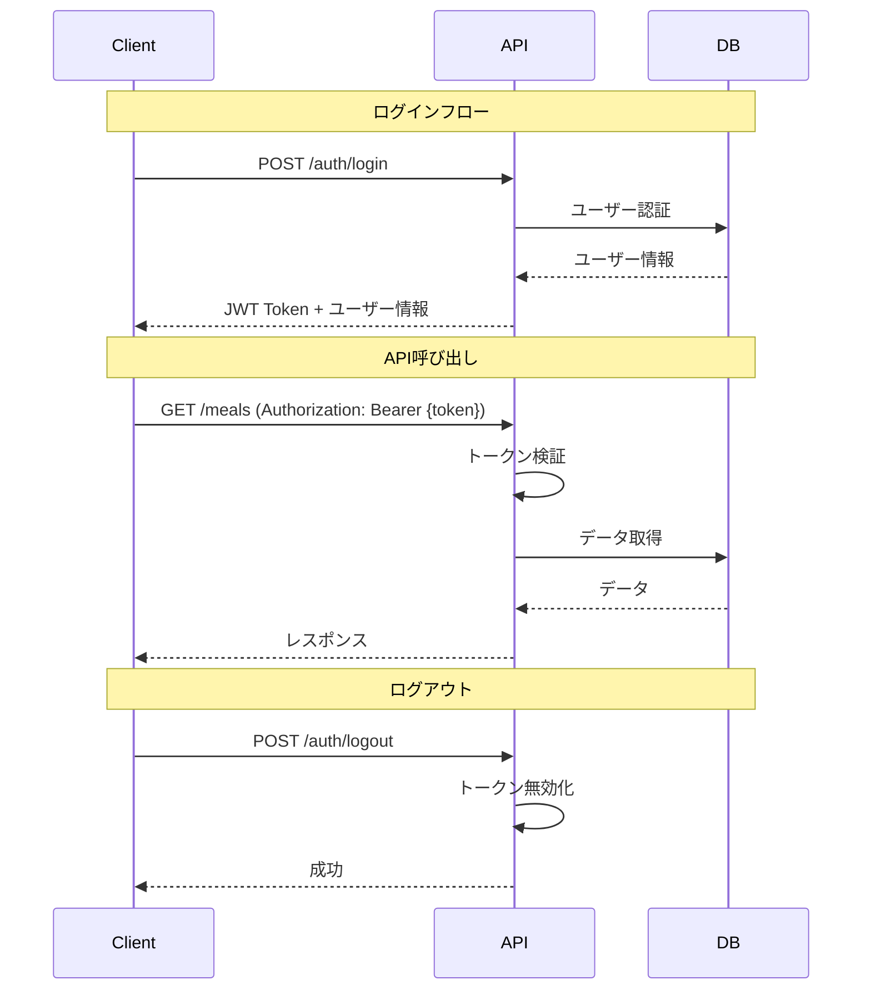

# API設計書

## 概要

カロリー・PFCバランス管理アプリのREST API設計

## 基本仕様

| 項目       | 内容               |
| ---------- | ------------------ |
| ベースURL  | `/api/v1`          |
| データ形式 | JSON               |
| 文字コード | UTF-8              |
| 認証方式   | Bearer Token (JWT) |

## 共通レスポンス

### 成功時

```json
{
  "success": true,
  "data": { ... }
}
```

### エラー時

```json
{
  "success": false,
  "error": {
    "code": "ERROR_CODE",
    "message": "エラーメッセージ"
  }
}
```

### HTTPステータスコード

| コード | 説明                 |
| ------ | -------------------- |
| 200    | 成功                 |
| 201    | 作成成功             |
| 400    | リクエスト不正       |
| 401    | 認証エラー           |
| 403    | 権限エラー           |
| 404    | リソース未発見       |
| 422    | バリデーションエラー |
| 500    | サーバーエラー       |

---

## API一覧

| カテゴリ   | メソッド | エンドポイント     | 説明                 |
| ---------- | -------- | ------------------ | -------------------- |
| 認証       | POST     | /auth/register     | ユーザー登録         |
| 認証       | POST     | /auth/login        | ログイン             |
| 認証       | POST     | /auth/logout       | ログアウト           |
| 認証       | GET      | /auth/me           | 認証ユーザー情報取得 |
| ユーザー   | PUT      | /users/me          | ユーザー情報更新     |
| ユーザー   | PUT      | /users/me/password | パスワード変更       |
| ユーザー   | PUT      | /users/me/targets  | 目標値更新           |
| 食品マスタ | GET      | /foods             | 食品一覧取得         |
| 食品マスタ | GET      | /foods/:id         | 食品詳細取得         |
| 食品マスタ | POST     | /foods             | 食品登録             |
| 食品マスタ | PUT      | /foods/:id         | 食品更新             |
| 食品マスタ | DELETE   | /foods/:id         | 食品削除             |
| 食事記録   | GET      | /meals             | 食事記録一覧取得     |
| 食事記録   | GET      | /meals/:id         | 食事記録詳細取得     |
| 食事記録   | POST     | /meals             | 食事記録登録         |
| 食事記録   | PUT      | /meals/:id         | 食事記録更新         |
| 食事記録   | DELETE   | /meals/:id         | 食事記録削除         |
| 集計       | GET      | /summary/daily     | 日次サマリー取得     |
| 集計       | GET      | /summary/monthly   | 月次サマリー取得     |

---

## 認証 API

### POST /auth/register

ユーザー新規登録

**リクエスト**

```json
{
  "name": "山田太郎",
  "email": "taro@example.com",
  "password": "password123"
}
```

| パラメータ | 型     | 必須 | 説明                    |
| ---------- | ------ | ---- | ----------------------- |
| name       | string | ○    | ユーザー名（1-100文字） |
| email      | string | ○    | メールアドレス          |
| password   | string | ○    | パスワード（8文字以上） |

**レスポンス（201）**

```json
{
  "success": true,
  "data": {
    "user": {
      "id": 1,
      "name": "山田太郎",
      "email": "taro@example.com",
      "daily_calorie_target": 2000,
      "daily_protein_target": 60,
      "daily_fat_target": 55,
      "daily_carb_target": 300,
      "created_at": "2026-01-21T10:00:00Z"
    },
    "token": "eyJhbGciOiJIUzI1NiIsInR5cCI6IkpXVCJ9..."
  }
}
```

---

### POST /auth/login

ログイン

**リクエスト**

```json
{
  "email": "taro@example.com",
  "password": "password123"
}
```

| パラメータ | 型     | 必須 | 説明           |
| ---------- | ------ | ---- | -------------- |
| email      | string | ○    | メールアドレス |
| password   | string | ○    | パスワード     |

**レスポンス（200）**

```json
{
  "success": true,
  "data": {
    "user": {
      "id": 1,
      "name": "山田太郎",
      "email": "taro@example.com",
      "daily_calorie_target": 2000,
      "daily_protein_target": 60,
      "daily_fat_target": 55,
      "daily_carb_target": 300
    },
    "token": "eyJhbGciOiJIUzI1NiIsInR5cCI6IkpXVCJ9..."
  }
}
```

**エラーレスポンス（401）**

```json
{
  "success": false,
  "error": {
    "code": "INVALID_CREDENTIALS",
    "message": "メールアドレスまたはパスワードが正しくありません"
  }
}
```

---

### POST /auth/logout

ログアウト

**ヘッダー**

```
Authorization: Bearer {token}
```

**レスポンス（200）**

```json
{
  "success": true,
  "data": {
    "message": "ログアウトしました"
  }
}
```

---

### GET /auth/me

認証ユーザー情報取得

**ヘッダー**

```
Authorization: Bearer {token}
```

**レスポンス（200）**

```json
{
  "success": true,
  "data": {
    "id": 1,
    "name": "山田太郎",
    "email": "taro@example.com",
    "daily_calorie_target": 2000,
    "daily_protein_target": 60,
    "daily_fat_target": 55,
    "daily_carb_target": 300,
    "created_at": "2026-01-21T10:00:00Z",
    "updated_at": "2026-01-21T10:00:00Z"
  }
}
```

---

## ユーザー API

### PUT /users/me

ユーザー情報更新

**ヘッダー**

```
Authorization: Bearer {token}
```

**リクエスト**

```json
{
  "name": "山田太郎（更新）",
  "email": "taro-new@example.com"
}
```

| パラメータ | 型     | 必須 | 説明           |
| ---------- | ------ | ---- | -------------- |
| name       | string | -    | ユーザー名     |
| email      | string | -    | メールアドレス |

**レスポンス（200）**

```json
{
  "success": true,
  "data": {
    "id": 1,
    "name": "山田太郎（更新）",
    "email": "taro-new@example.com",
    "daily_calorie_target": 2000,
    "daily_protein_target": 60,
    "daily_fat_target": 55,
    "daily_carb_target": 300,
    "updated_at": "2026-01-21T12:00:00Z"
  }
}
```

---

### PUT /users/me/password

パスワード変更

**ヘッダー**

```
Authorization: Bearer {token}
```

**リクエスト**

```json
{
  "current_password": "password123",
  "new_password": "newpassword456"
}
```

| パラメータ       | 型     | 必須 | 説明                          |
| ---------------- | ------ | ---- | ----------------------------- |
| current_password | string | ○    | 現在のパスワード              |
| new_password     | string | ○    | 新しいパスワード（8文字以上） |

**レスポンス（200）**

```json
{
  "success": true,
  "data": {
    "message": "パスワードを変更しました"
  }
}
```

---

### PUT /users/me/targets

目標値更新

**ヘッダー**

```
Authorization: Bearer {token}
```

**リクエスト**

```json
{
  "daily_calorie_target": 1800,
  "daily_protein_target": 80,
  "daily_fat_target": 50,
  "daily_carb_target": 250
}
```

| パラメータ           | 型      | 必須 | 説明                      |
| -------------------- | ------- | ---- | ------------------------- |
| daily_calorie_target | integer | -    | 目標カロリー（500-10000） |
| daily_protein_target | integer | -    | 目標タンパク質（1-500）   |
| daily_fat_target     | integer | -    | 目標脂質（1-500）         |
| daily_carb_target    | integer | -    | 目標炭水化物（1-1000）    |

**レスポンス（200）**

```json
{
  "success": true,
  "data": {
    "daily_calorie_target": 1800,
    "daily_protein_target": 80,
    "daily_fat_target": 50,
    "daily_carb_target": 250,
    "updated_at": "2026-01-21T12:00:00Z"
  }
}
```

---

## 食品マスタ API

### GET /foods

食品一覧取得

**ヘッダー**

```
Authorization: Bearer {token}
```

**クエリパラメータ**

| パラメータ | 型      | 必須 | 説明                                  |
| ---------- | ------- | ---- | ------------------------------------- |
| q          | string  | -    | 検索キーワード                        |
| page       | integer | -    | ページ番号（デフォルト: 1）           |
| limit      | integer | -    | 取得件数（デフォルト: 20、最大: 100） |

**リクエスト例**

```
GET /api/v1/foods?q=鶏肉&page=1&limit=20
```

**レスポンス（200）**

```json
{
  "success": true,
  "data": {
    "foods": [
      {
        "id": 1,
        "name": "鶏むね肉",
        "calories": 165.0,
        "protein": 31.0,
        "fat": 4.0,
        "carbohydrate": 0.0,
        "serving_size": 100.0,
        "serving_unit": "g",
        "is_default": false,
        "created_at": "2026-01-20T10:00:00Z"
      },
      {
        "id": 2,
        "name": "鶏もも肉",
        "calories": 200.0,
        "protein": 16.0,
        "fat": 14.0,
        "carbohydrate": 0.0,
        "serving_size": 100.0,
        "serving_unit": "g",
        "is_default": false,
        "created_at": "2026-01-20T10:00:00Z"
      }
    ],
    "pagination": {
      "current_page": 1,
      "total_pages": 1,
      "total_count": 2,
      "limit": 20
    }
  }
}
```

---

### GET /foods/:id

食品詳細取得

**ヘッダー**

```
Authorization: Bearer {token}
```

**レスポンス（200）**

```json
{
  "success": true,
  "data": {
    "id": 1,
    "name": "鶏むね肉",
    "calories": 165.0,
    "protein": 31.0,
    "fat": 4.0,
    "carbohydrate": 0.0,
    "serving_size": 100.0,
    "serving_unit": "g",
    "is_default": false,
    "user_id": 1,
    "created_at": "2026-01-20T10:00:00Z",
    "updated_at": "2026-01-20T10:00:00Z"
  }
}
```

---

### POST /foods

食品登録

**ヘッダー**

```
Authorization: Bearer {token}
```

**リクエスト**

```json
{
  "name": "プロテインバー",
  "calories": 200,
  "protein": 20,
  "fat": 8,
  "carbohydrate": 15,
  "serving_size": 1,
  "serving_unit": "個"
}
```

| パラメータ   | 型      | 必須 | 説明                  |
| ------------ | ------- | ---- | --------------------- |
| name         | string  | ○    | 食品名（1-200文字）   |
| calories     | decimal | ○    | カロリー（0以上）     |
| protein      | decimal | ○    | タンパク質（0以上）   |
| fat          | decimal | ○    | 脂質（0以上）         |
| carbohydrate | decimal | ○    | 炭水化物（0以上）     |
| serving_size | decimal | ○    | 基準量（1以上）       |
| serving_unit | string  | ○    | 単位（g/ml/個/杯/枚） |

**レスポンス（201）**

```json
{
  "success": true,
  "data": {
    "id": 10,
    "name": "プロテインバー",
    "calories": 200.0,
    "protein": 20.0,
    "fat": 8.0,
    "carbohydrate": 15.0,
    "serving_size": 1.0,
    "serving_unit": "個",
    "is_default": false,
    "user_id": 1,
    "created_at": "2026-01-21T10:00:00Z"
  }
}
```

---

### PUT /foods/:id

食品更新

**ヘッダー**

```
Authorization: Bearer {token}
```

**リクエスト**

```json
{
  "name": "プロテインバー（チョコ味）",
  "calories": 210
}
```

| パラメータ   | 型      | 必須 | 説明       |
| ------------ | ------- | ---- | ---------- |
| name         | string  | -    | 食品名     |
| calories     | decimal | -    | カロリー   |
| protein      | decimal | -    | タンパク質 |
| fat          | decimal | -    | 脂質       |
| carbohydrate | decimal | -    | 炭水化物   |
| serving_size | decimal | -    | 基準量     |
| serving_unit | string  | -    | 単位       |

**レスポンス（200）**

```json
{
  "success": true,
  "data": {
    "id": 10,
    "name": "プロテインバー（チョコ味）",
    "calories": 210.0,
    "protein": 20.0,
    "fat": 8.0,
    "carbohydrate": 15.0,
    "serving_size": 1.0,
    "serving_unit": "個",
    "is_default": false,
    "user_id": 1,
    "updated_at": "2026-01-21T12:00:00Z"
  }
}
```

---

### DELETE /foods/:id

食品削除

**ヘッダー**

```
Authorization: Bearer {token}
```

**レスポンス（200）**

```json
{
  "success": true,
  "data": {
    "message": "食品を削除しました"
  }
}
```

**エラーレスポンス（400）**

```json
{
  "success": false,
  "error": {
    "code": "FOOD_IN_USE",
    "message": "この食品は食事記録で使用されているため削除できません"
  }
}
```

---

## 食事記録 API

### GET /meals

食事記録一覧取得

**ヘッダー**

```
Authorization: Bearer {token}
```

**クエリパラメータ**

| パラメータ | 型     | 必須 | 説明                                       |
| ---------- | ------ | ---- | ------------------------------------------ |
| date       | string | -    | 日付（YYYY-MM-DD）                         |
| start_date | string | -    | 開始日（YYYY-MM-DD）                       |
| end_date   | string | -    | 終了日（YYYY-MM-DD）                       |
| meal_type  | string | -    | 食事タイプ（breakfast/lunch/dinner/snack） |

**リクエスト例**

```
GET /api/v1/meals?date=2026-01-21
```

**レスポンス（200）**

```json
{
  "success": true,
  "data": {
    "meals": [
      {
        "id": 1,
        "record_date": "2026-01-21",
        "meal_type": "breakfast",
        "memo": null,
        "items": [
          {
            "id": 1,
            "food": {
              "id": 5,
              "name": "白米",
              "serving_unit": "杯"
            },
            "quantity": 1.0,
            "calories": 270.0,
            "protein": 4.0,
            "fat": 0.5,
            "carbohydrate": 59.0
          },
          {
            "id": 2,
            "food": {
              "id": 8,
              "name": "目玉焼き",
              "serving_unit": "個"
            },
            "quantity": 1.0,
            "calories": 150.0,
            "protein": 12.0,
            "fat": 11.0,
            "carbohydrate": 0.5
          }
        ],
        "totals": {
          "calories": 420.0,
          "protein": 16.0,
          "fat": 11.5,
          "carbohydrate": 59.5
        },
        "created_at": "2026-01-21T07:30:00Z"
      },
      {
        "id": 2,
        "record_date": "2026-01-21",
        "meal_type": "lunch",
        "memo": "外食",
        "items": [
          {
            "id": 3,
            "food": {
              "id": 15,
              "name": "ラーメン",
              "serving_unit": "杯"
            },
            "quantity": 1.0,
            "calories": 750.0,
            "protein": 25.0,
            "fat": 30.0,
            "carbohydrate": 90.0
          }
        ],
        "totals": {
          "calories": 750.0,
          "protein": 25.0,
          "fat": 30.0,
          "carbohydrate": 90.0
        },
        "created_at": "2026-01-21T12:30:00Z"
      }
    ]
  }
}
```

---

### GET /meals/:id

食事記録詳細取得

**ヘッダー**

```
Authorization: Bearer {token}
```

**レスポンス（200）**

```json
{
  "success": true,
  "data": {
    "id": 1,
    "record_date": "2026-01-21",
    "meal_type": "breakfast",
    "memo": null,
    "items": [
      {
        "id": 1,
        "food": {
          "id": 5,
          "name": "白米",
          "calories": 270.0,
          "protein": 4.0,
          "fat": 0.5,
          "carbohydrate": 59.0,
          "serving_size": 150.0,
          "serving_unit": "g"
        },
        "quantity": 1.0,
        "calories": 270.0,
        "protein": 4.0,
        "fat": 0.5,
        "carbohydrate": 59.0
      }
    ],
    "totals": {
      "calories": 270.0,
      "protein": 4.0,
      "fat": 0.5,
      "carbohydrate": 59.0
    },
    "created_at": "2026-01-21T07:30:00Z",
    "updated_at": "2026-01-21T07:30:00Z"
  }
}
```

---

### POST /meals

食事記録登録

**ヘッダー**

```
Authorization: Bearer {token}
```

**リクエスト**

```json
{
  "record_date": "2026-01-21",
  "meal_type": "dinner",
  "memo": "筋トレ後の食事",
  "items": [
    {
      "food_id": 1,
      "quantity": 1.5
    },
    {
      "food_id": 5,
      "quantity": 1.0
    }
  ]
}
```

| パラメータ       | 型      | 必須 | 説明                                       |
| ---------------- | ------- | ---- | ------------------------------------------ |
| record_date      | string  | ○    | 記録日（YYYY-MM-DD）                       |
| meal_type        | string  | ○    | 食事タイプ（breakfast/lunch/dinner/snack） |
| memo             | string  | -    | メモ（500文字以内）                        |
| items            | array   | ○    | 食品リスト（1件以上）                      |
| items[].food_id  | integer | ○    | 食品マスタID                               |
| items[].quantity | decimal | ○    | 数量（0.1以上）                            |

**レスポンス（201）**

```json
{
  "success": true,
  "data": {
    "id": 5,
    "record_date": "2026-01-21",
    "meal_type": "dinner",
    "memo": "筋トレ後の食事",
    "items": [
      {
        "id": 10,
        "food": {
          "id": 1,
          "name": "鶏むね肉",
          "serving_unit": "g"
        },
        "quantity": 1.5,
        "calories": 247.5,
        "protein": 46.5,
        "fat": 6.0,
        "carbohydrate": 0.0
      },
      {
        "id": 11,
        "food": {
          "id": 5,
          "name": "白米",
          "serving_unit": "杯"
        },
        "quantity": 1.0,
        "calories": 270.0,
        "protein": 4.0,
        "fat": 0.5,
        "carbohydrate": 59.0
      }
    ],
    "totals": {
      "calories": 517.5,
      "protein": 50.5,
      "fat": 6.5,
      "carbohydrate": 59.0
    },
    "created_at": "2026-01-21T19:00:00Z"
  }
}
```

---

### PUT /meals/:id

食事記録更新

**ヘッダー**

```
Authorization: Bearer {token}
```

**リクエスト**

```json
{
  "meal_type": "dinner",
  "memo": "筋トレ後の食事（更新）",
  "items": [
    {
      "food_id": 1,
      "quantity": 2.0
    },
    {
      "food_id": 5,
      "quantity": 1.0
    },
    {
      "food_id": 12,
      "quantity": 1.0
    }
  ]
}
```

| パラメータ | 型     | 必須 | 説明                         |
| ---------- | ------ | ---- | ---------------------------- |
| meal_type  | string | -    | 食事タイプ                   |
| memo       | string | -    | メモ                         |
| items      | array  | -    | 食品リスト（指定時は全置換） |

**レスポンス（200）**

```json
{
  "success": true,
  "data": {
    "id": 5,
    "record_date": "2026-01-21",
    "meal_type": "dinner",
    "memo": "筋トレ後の食事（更新）",
    "items": [
      {
        "id": 15,
        "food": {
          "id": 1,
          "name": "鶏むね肉",
          "serving_unit": "g"
        },
        "quantity": 2.0,
        "calories": 330.0,
        "protein": 62.0,
        "fat": 8.0,
        "carbohydrate": 0.0
      },
      {
        "id": 16,
        "food": {
          "id": 5,
          "name": "白米",
          "serving_unit": "杯"
        },
        "quantity": 1.0,
        "calories": 270.0,
        "protein": 4.0,
        "fat": 0.5,
        "carbohydrate": 59.0
      },
      {
        "id": 17,
        "food": {
          "id": 12,
          "name": "ブロッコリー",
          "serving_unit": "g"
        },
        "quantity": 1.0,
        "calories": 33.0,
        "protein": 4.3,
        "fat": 0.5,
        "carbohydrate": 5.2
      }
    ],
    "totals": {
      "calories": 633.0,
      "protein": 70.3,
      "fat": 9.0,
      "carbohydrate": 64.2
    },
    "updated_at": "2026-01-21T19:30:00Z"
  }
}
```

---

### DELETE /meals/:id

食事記録削除

**ヘッダー**

```
Authorization: Bearer {token}
```

**レスポンス（200）**

```json
{
  "success": true,
  "data": {
    "message": "食事記録を削除しました"
  }
}
```

---

## 集計 API

### GET /summary/daily

日次サマリー取得

**ヘッダー**

```
Authorization: Bearer {token}
```

**クエリパラメータ**

| パラメータ | 型     | 必須 | 説明               |
| ---------- | ------ | ---- | ------------------ |
| date       | string | ○    | 日付（YYYY-MM-DD） |

**リクエスト例**

```
GET /api/v1/summary/daily?date=2026-01-21
```

**レスポンス（200）**

```json
{
  "success": true,
  "data": {
    "date": "2026-01-21",
    "totals": {
      "calories": 1850.0,
      "protein": 65.0,
      "fat": 50.0,
      "carbohydrate": 280.0
    },
    "targets": {
      "calories": 2000,
      "protein": 60,
      "fat": 55,
      "carbohydrate": 300
    },
    "achievement": {
      "calories": 92.5,
      "protein": 108.3,
      "fat": 90.9,
      "carbohydrate": 93.3
    },
    "by_meal_type": {
      "breakfast": {
        "calories": 520.0,
        "protein": 16.0,
        "fat": 12.0,
        "carbohydrate": 85.0
      },
      "lunch": {
        "calories": 750.0,
        "protein": 25.0,
        "fat": 30.0,
        "carbohydrate": 90.0
      },
      "dinner": {
        "calories": 580.0,
        "protein": 24.0,
        "fat": 8.0,
        "carbohydrate": 105.0
      },
      "snack": {
        "calories": 0,
        "protein": 0,
        "fat": 0,
        "carbohydrate": 0
      }
    }
  }
}
```

---

### GET /summary/monthly

月次サマリー取得（カレンダー表示用）

**ヘッダー**

```
Authorization: Bearer {token}
```

**クエリパラメータ**

| パラメータ | 型      | 必須 | 説明           |
| ---------- | ------- | ---- | -------------- |
| year       | integer | ○    | 年（例: 2026） |
| month      | integer | ○    | 月（1-12）     |

**リクエスト例**

```
GET /api/v1/summary/monthly?year=2026&month=1
```

**レスポンス（200）**

```json
{
  "success": true,
  "data": {
    "year": 2026,
    "month": 1,
    "targets": {
      "calories": 2000,
      "protein": 60,
      "fat": 55,
      "carbohydrate": 300
    },
    "daily_summaries": [
      {
        "date": "2026-01-01",
        "calories": 1800.0,
        "protein": 55.0,
        "fat": 48.0,
        "carbohydrate": 270.0,
        "has_records": true
      },
      {
        "date": "2026-01-02",
        "calories": 2100.0,
        "protein": 70.0,
        "fat": 60.0,
        "carbohydrate": 320.0,
        "has_records": true
      },
      {
        "date": "2026-01-03",
        "calories": 0,
        "protein": 0,
        "fat": 0,
        "carbohydrate": 0,
        "has_records": false
      }
    ],
    "monthly_average": {
      "calories": 1950.0,
      "protein": 62.5,
      "fat": 54.0,
      "carbohydrate": 295.0
    }
  }
}
```

---

## エラーコード一覧

| コード               | HTTPステータス | 説明                   |
| -------------------- | -------------- | ---------------------- |
| VALIDATION_ERROR     | 422            | バリデーションエラー   |
| INVALID_CREDENTIALS  | 401            | 認証情報が不正         |
| TOKEN_EXPIRED        | 401            | トークン期限切れ       |
| TOKEN_INVALID        | 401            | トークンが不正         |
| UNAUTHORIZED         | 401            | 認証が必要             |
| FORBIDDEN            | 403            | アクセス権限なし       |
| NOT_FOUND            | 404            | リソースが見つからない |
| EMAIL_ALREADY_EXISTS | 400            | メールアドレス重複     |
| FOOD_IN_USE          | 400            | 使用中の食品は削除不可 |
| INTERNAL_ERROR       | 500            | サーバー内部エラー     |

---

## 認証フロー


