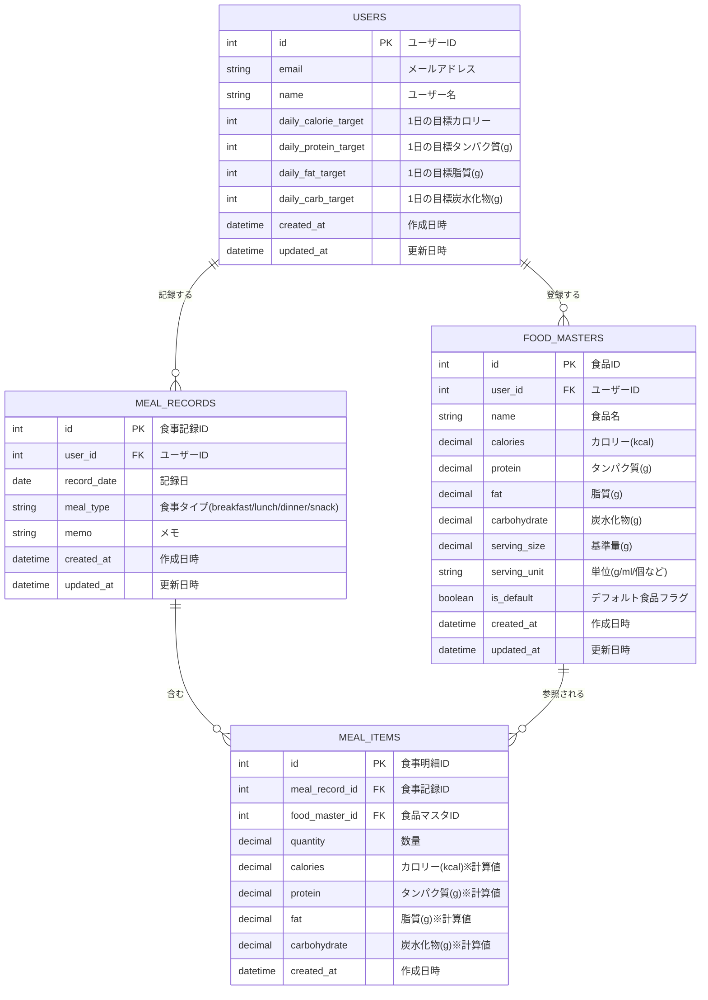

# データベース設計書

## 概要

カロリー・PFCバランス管理アプリのデータベース設計

## ER図



---

## テーブル定義

### USERS（ユーザー）

ユーザー情報と1日の目標値を管理するテーブル

| カラム名             | データ型     | NULL | デフォルト        | 説明                       |
| -------------------- | ------------ | ---- | ----------------- | -------------------------- |
| id                   | INT          | NO   | AUTO_INCREMENT    | 主キー                     |
| email                | VARCHAR(255) | NO   | -                 | メールアドレス（ユニーク） |
| password_hash        | VARCHAR(255) | NO   | -                 | パスワードハッシュ         |
| name                 | VARCHAR(100) | NO   | -                 | ユーザー名                 |
| daily_calorie_target | INT          | YES  | 2000              | 1日の目標カロリー(kcal)    |
| daily_protein_target | INT          | YES  | 60                | 1日の目標タンパク質(g)     |
| daily_fat_target     | INT          | YES  | 55                | 1日の目標脂質(g)           |
| daily_carb_target    | INT          | YES  | 300               | 1日の目標炭水化物(g)       |
| created_at           | DATETIME     | NO   | CURRENT_TIMESTAMP | 作成日時                   |
| updated_at           | DATETIME     | NO   | CURRENT_TIMESTAMP | 更新日時                   |

**インデックス**

- PRIMARY KEY (id)
- UNIQUE (email)

---

### FOOD_MASTERS（食品マスタ）

ユーザーが登録した食品情報を保存するテーブル

| カラム名     | データ型     | NULL | デフォルト        | 説明                             |
| ------------ | ------------ | ---- | ----------------- | -------------------------------- |
| id           | INT          | NO   | AUTO_INCREMENT    | 主キー                           |
| user_id      | INT          | YES  | NULL              | ユーザーID（NULLはシステム共通） |
| name         | VARCHAR(200) | NO   | -                 | 食品名                           |
| calories     | DECIMAL(8,2) | NO   | -                 | カロリー(kcal)                   |
| protein      | DECIMAL(8,2) | NO   | -                 | タンパク質(g)                    |
| fat          | DECIMAL(8,2) | NO   | -                 | 脂質(g)                          |
| carbohydrate | DECIMAL(8,2) | NO   | -                 | 炭水化物(g)                      |
| serving_size | DECIMAL(8,2) | NO   | 100               | 基準量                           |
| serving_unit | VARCHAR(20)  | NO   | 'g'               | 単位（g/ml/個など）              |
| is_default   | BOOLEAN      | NO   | FALSE             | デフォルト食品フラグ             |
| created_at   | DATETIME     | NO   | CURRENT_TIMESTAMP | 作成日時                         |
| updated_at   | DATETIME     | NO   | CURRENT_TIMESTAMP | 更新日時                         |

**インデックス**

- PRIMARY KEY (id)
- INDEX (user_id)
- INDEX (name)

**外部キー**

- user_id → USERS(id) ON DELETE CASCADE

---

### MEAL_RECORDS（食事記録）

食事記録の親テーブル。日付と食事タイミングを管理

| カラム名    | データ型 | NULL | デフォルト        | 説明       |
| ----------- | -------- | ---- | ----------------- | ---------- |
| id          | INT      | NO   | AUTO_INCREMENT    | 主キー     |
| user_id     | INT      | NO   | -                 | ユーザーID |
| record_date | DATE     | NO   | -                 | 記録日     |
| meal_type   | ENUM     | NO   | -                 | 食事タイプ |
| memo        | TEXT     | YES  | NULL              | メモ       |
| created_at  | DATETIME | NO   | CURRENT_TIMESTAMP | 作成日時   |
| updated_at  | DATETIME | NO   | CURRENT_TIMESTAMP | 更新日時   |

**meal_type の値**

- `breakfast`: 朝食
- `lunch`: 昼食
- `dinner`: 夕食
- `snack`: 間食

**インデックス**

- PRIMARY KEY (id)
- INDEX (user_id, record_date)
- INDEX (record_date)

**外部キー**

- user_id → USERS(id) ON DELETE CASCADE

---

### MEAL_ITEMS（食事明細）

食事記録の明細テーブル。実際に食べた食品と数量を記録

| カラム名       | データ型     | NULL | デフォルト        | 説明                  |
| -------------- | ------------ | ---- | ----------------- | --------------------- |
| id             | INT          | NO   | AUTO_INCREMENT    | 主キー                |
| meal_record_id | INT          | NO   | -                 | 食事記録ID            |
| food_master_id | INT          | NO   | -                 | 食品マスタID          |
| quantity       | DECIMAL(8,2) | NO   | 1                 | 数量（倍率）          |
| calories       | DECIMAL(8,2) | NO   | -                 | カロリー(kcal)※計算値 |
| protein        | DECIMAL(8,2) | NO   | -                 | タンパク質(g)※計算値  |
| fat            | DECIMAL(8,2) | NO   | -                 | 脂質(g)※計算値        |
| carbohydrate   | DECIMAL(8,2) | NO   | -                 | 炭水化物(g)※計算値    |
| created_at     | DATETIME     | NO   | CURRENT_TIMESTAMP | 作成日時              |

**インデックス**

- PRIMARY KEY (id)
- INDEX (meal_record_id)
- INDEX (food_master_id)

**外部キー**

- meal_record_id → MEAL_RECORDS(id) ON DELETE CASCADE
- food_master_id → FOOD_MASTERS(id) ON DELETE RESTRICT

---

## 補足

### 計算値の保存について

MEAL_ITEMS テーブルにカロリー・PFC値を保存する理由：

1. 食品マスタの値が後から変更されても、記録時点の値を保持できる
2. 日次集計時のパフォーマンス向上

### 日次集計クエリ例

```sql
SELECT
    mr.record_date,
    SUM(mi.calories) as total_calories,
    SUM(mi.protein) as total_protein,
    SUM(mi.fat) as total_fat,
    SUM(mi.carbohydrate) as total_carbohydrate
FROM MEAL_RECORDS mr
JOIN MEAL_ITEMS mi ON mr.id = mi.meal_record_id
WHERE mr.user_id = :user_id
  AND mr.record_date = :target_date
GROUP BY mr.record_date;
```
