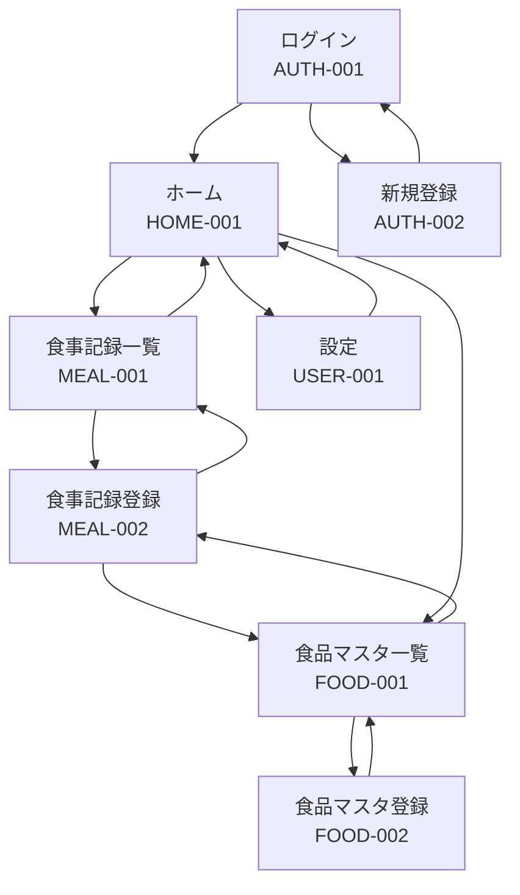

# 画面定義書

## 概要

カロリー・PFCバランス管理アプリの画面設計

---

## 画面一覧

| No  | 画面ID   | 画面名               | 説明                           |
| --- | -------- | -------------------- | ------------------------------ |
| 1   | AUTH-001 | ログイン             | ユーザー認証画面               |
| 2   | AUTH-002 | 新規登録             | ユーザー新規登録画面           |
| 3   | HOME-001 | ホーム（カレンダー） | カレンダー形式で食事記録を表示 |
| 4   | MEAL-001 | 食事記録一覧         | 選択日の食事記録一覧           |
| 5   | MEAL-002 | 食事記録登録         | 食事内容の入力画面             |
| 6   | FOOD-001 | 食品マスタ一覧       | 登録済み食品の一覧             |
| 7   | FOOD-002 | 食品マスタ登録       | 新規食品の登録画面             |
| 8   | USER-001 | 設定                 | ユーザー設定・目標値設定       |

---

## 画面遷移図



---

## 画面詳細

### AUTH-001: ログイン画面

**概要**
ユーザーがアプリにログインする画面

**URL**
`/login`

**レイアウト**

```
┌─────────────────────────────────────┐
│           My Nutri Log              │
│                                     │
│  ┌───────────────────────────────┐  │
│  │ メールアドレス                │  │
│  └───────────────────────────────┘  │
│                                     │
│  ┌───────────────────────────────┐  │
│  │ パスワード                    │  │
│  └───────────────────────────────┘  │
│                                     │
│  ┌───────────────────────────────┐  │
│  │         ログイン              │  │
│  └───────────────────────────────┘  │
│                                     │
│      アカウントをお持ちでない方      │
│         新規登録はこちら            │
└─────────────────────────────────────┘
```

**入力項目**

| 項目名         | 入力形式   | 必須 | バリデーション |
| -------------- | ---------- | ---- | -------------- |
| メールアドレス | テキスト   | ○    | メール形式     |
| パスワード     | パスワード | ○    | 8文字以上      |

**アクション**

| ボタン           | 処理     | 遷移先   |
| ---------------- | -------- | -------- |
| ログイン         | 認証処理 | HOME-001 |
| 新規登録はこちら | -        | AUTH-002 |

---

### AUTH-002: 新規登録画面

**概要**
新規ユーザーアカウントを作成する画面

**URL**
`/register`

**レイアウト**

```
┌─────────────────────────────────────┐
│           新規登録                  │
│                                     │
│  ┌───────────────────────────────┐  │
│  │ ユーザー名                    │  │
│  └───────────────────────────────┘  │
│                                     │
│  ┌───────────────────────────────┐  │
│  │ メールアドレス                │  │
│  └───────────────────────────────┘  │
│                                     │
│  ┌───────────────────────────────┐  │
│  │ パスワード                    │  │
│  └───────────────────────────────┘  │
│                                     │
│  ┌───────────────────────────────┐  │
│  │ パスワード（確認）            │  │
│  └───────────────────────────────┘  │
│                                     │
│  ┌───────────────────────────────┐  │
│  │         登録する              │  │
│  └───────────────────────────────┘  │
│                                     │
│      すでにアカウントをお持ちの方    │
│         ログインはこちら            │
└─────────────────────────────────────┘
```

**入力項目**

| 項目名             | 入力形式   | 必須 | バリデーション       |
| ------------------ | ---------- | ---- | -------------------- |
| ユーザー名         | テキスト   | ○    | 1-100文字            |
| メールアドレス     | テキスト   | ○    | メール形式、重複不可 |
| パスワード         | パスワード | ○    | 8文字以上            |
| パスワード（確認） | パスワード | ○    | パスワードと一致     |

**アクション**

| ボタン           | 処理         | 遷移先   |
| ---------------- | ------------ | -------- |
| 登録する         | ユーザー作成 | AUTH-001 |
| ログインはこちら | -            | AUTH-001 |

---

### HOME-001: ホーム画面（カレンダー）

**概要**
月間カレンダー形式で食事記録の概要を表示するメイン画面

**URL**
`/`

**レイアウト**

```
┌─────────────────────────────────────────────────┐
│  ≡  My Nutri Log                    [User] ⚙️   │
├─────────────────────────────────────────────────┤
│                                                 │
│   ◀  2026年1月  ▶                              │
│                                                 │
│  日   月   火   水   木   金   土               │
│ ┌────┬────┬────┬────┬────┬────┬────┐           │
│ │    │    │    │ 1  │ 2  │ 3  │ 4  │           │
│ │    │    │    │1800│2100│1950│    │           │
│ ├────┼────┼────┼────┼────┼────┼────┤           │
│ │ 5  │ 6  │ 7  │ 8  │ 9  │ 10 │ 11 │           │
│ │2000│1850│2200│    │    │    │    │           │
│ └────┴────┴────┴────┴────┴────┴────┘           │
│                                                 │
│  ────────────────────────────────────           │
│  本日のサマリー (1/21)                          │
│  ┌─────────────────────────────────┐            │
│  │ カロリー: 1,850 / 2,000 kcal    │            │
│  │ ████████████████░░░░  92%       │            │
│  │                                 │            │
│  │ P: 65g/60g  F: 50g/55g  C: 280g/300g │       │
│  └─────────────────────────────────┘            │
│                                                 │
│           ＋ 食事を記録する                     │
│                                                 │
├─────────────────────────────────────────────────┤
│  🏠 ホーム   📋 食品    ⚙️ 設定                 │
└─────────────────────────────────────────────────┘
```

**表示項目**

| 項目           | 説明                          |
| -------------- | ----------------------------- |
| 月間カレンダー | 日毎の合計カロリーを表示      |
| 本日のサマリー | 選択日のカロリー・PFC達成状況 |
| プログレスバー | 目標に対する達成率を視覚化    |

**アクション**

| 操作             | 処理         | 遷移先   |
| ---------------- | ------------ | -------- |
| 日付タップ       | 選択日の変更 | -        |
| 日付ダブルタップ | 詳細表示     | MEAL-001 |
| ＋食事を記録する | -            | MEAL-002 |
| 設定アイコン     | -            | USER-001 |

---

### MEAL-001: 食事記録一覧画面

**概要**
選択した日付の食事記録を一覧表示する画面

**URL**
`/meals?date=2026-01-21`

**レイアウト**

```
┌─────────────────────────────────────────────────┐
│  ←  1月21日（火）の食事                         │
├─────────────────────────────────────────────────┤
│                                                 │
│  ── 朝食 ──────────────────────── 520 kcal     │
│  ┌─────────────────────────────────────────┐   │
│  │ 🍚 白米 (1杯)           270 kcal        │   │
│  │ 🥚 目玉焼き (1個)       150 kcal        │   │
│  │ 🥗 サラダ (1皿)         100 kcal        │   │
│  └─────────────────────────────────────────┘   │
│                                    [+ 追加]    │
│                                                 │
│  ── 昼食 ──────────────────────── 750 kcal     │
│  ┌─────────────────────────────────────────┐   │
│  │ 🍜 ラーメン (1杯)       750 kcal        │   │
│  └─────────────────────────────────────────┘   │
│                                    [+ 追加]    │
│                                                 │
│  ── 夕食 ──────────────────────── 580 kcal     │
│  ┌─────────────────────────────────────────┐   │
│  │ 🍖 鶏むね肉 (150g)      230 kcal        │   │
│  │ 🍚 玄米 (1杯)           250 kcal        │   │
│  │ 🥦 ブロッコリー (100g)  100 kcal        │   │
│  └─────────────────────────────────────────┘   │
│                                    [+ 追加]    │
│                                                 │
│  ── 間食 ────────────────────────   0 kcal     │
│  ┌─────────────────────────────────────────┐   │
│  │ （記録なし）                            │   │
│  └─────────────────────────────────────────┘   │
│                                    [+ 追加]    │
│                                                 │
├─────────────────────────────────────────────────┤
│  合計: 1,850 kcal                              │
│  P: 65g  |  F: 50g  |  C: 280g                 │
└─────────────────────────────────────────────────┘
```

**表示項目**

| 項目                   | 説明                           |
| ---------------------- | ------------------------------ |
| 食事タイプ別セクション | 朝食・昼食・夕食・間食         |
| 食品リスト             | 各食事に登録された食品と栄養素 |
| 日次合計               | カロリー・PFCの1日合計         |

**アクション**

| 操作         | 処理             | 遷移先   |
| ------------ | ---------------- | -------- |
| ←            | 戻る             | HOME-001 |
| + 追加       | 該当タイプで追加 | MEAL-002 |
| 食品タップ   | 編集モード       | MEAL-002 |
| 食品スワイプ | 削除確認         | -        |

---

### MEAL-002: 食事記録登録画面

**概要**
食事内容を入力・登録する画面

**URL**
`/meals/new?date=2026-01-21&type=breakfast`

**レイアウト**

```
┌─────────────────────────────────────────────────┐
│  ←  食事を記録                      [保存]     │
├─────────────────────────────────────────────────┤
│                                                 │
│  日付: 2026年1月21日                           │
│  ┌─────────────────────────────────────────┐   │
│  │ ○ 朝食  ○ 昼食  ● 夕食  ○ 間食        │   │
│  └─────────────────────────────────────────┘   │
│                                                 │
│  ── 食品を追加 ─────────────────────────────   │
│  ┌─────────────────────────────────────────┐   │
│  │ 🔍 食品名で検索...                      │   │
│  └─────────────────────────────────────────┘   │
│                                                 │
│  最近使った食品                                │
│  ┌─────────────────────────────────────────┐   │
│  │ 白米 (1杯)              270 kcal    [+] │   │
│  │ 鶏むね肉 (100g)         165 kcal    [+] │   │
│  │ サラダチキン (1個)      125 kcal    [+] │   │
│  └─────────────────────────────────────────┘   │
│                                                 │
│  [+ 新しい食品を登録]                          │
│                                                 │
│  ── 追加済みの食品 ─────────────────────────   │
│  ┌─────────────────────────────────────────┐   │
│  │ 鶏むね肉 (100g)                         │   │
│  │ 数量: [-] 1.5 [+]       248 kcal    [×] │   │
│  │                                         │   │
│  │ 玄米 (1杯)                              │   │
│  │ 数量: [-] 1.0 [+]       250 kcal    [×] │   │
│  └─────────────────────────────────────────┘   │
│                                                 │
│  ── メモ ───────────────────────────────────   │
│  ┌─────────────────────────────────────────┐   │
│  │                                         │   │
│  └─────────────────────────────────────────┘   │
│                                                 │
├─────────────────────────────────────────────────┤
│  合計: 498 kcal                                │
│  P: 42g  |  F: 8g  |  C: 58g                   │
└─────────────────────────────────────────────────┘
```

**入力項目**

| 項目名     | 入力形式       | 必須 | バリデーション |
| ---------- | -------------- | ---- | -------------- |
| 日付       | 日付選択       | ○    | -              |
| 食事タイプ | ラジオボタン   | ○    | -              |
| 食品検索   | テキスト       | -    | -              |
| 数量       | 数値           | ○    | 0.1以上        |
| メモ       | テキストエリア | -    | 500文字以内    |

**アクション**

| 操作             | 処理           | 遷移先   |
| ---------------- | -------------- | -------- |
| 保存             | 食事記録保存   | MEAL-001 |
| + (食品追加)     | リストに追加   | -        |
| × (削除)         | リストから削除 | -        |
| 新しい食品を登録 | -              | FOOD-002 |

---

### FOOD-001: 食品マスタ一覧画面

**概要**
登録済みの食品マスタを一覧表示・管理する画面

**URL**
`/foods`

**レイアウト**

```
┌─────────────────────────────────────────────────┐
│  ←  食品マスタ                      [+ 追加]   │
├─────────────────────────────────────────────────┤
│  ┌─────────────────────────────────────────┐   │
│  │ 🔍 食品名で検索...                      │   │
│  └─────────────────────────────────────────┘   │
│                                                 │
│  ── マイ食品 ───────────────────────────────   │
│  ┌─────────────────────────────────────────┐   │
│  │ 自家製プロテインスムージー              │   │
│  │ 350 kcal | P:30g F:8g C:35g      [>]    │   │
│  ├─────────────────────────────────────────┤   │
│  │ 朝食セット（トースト+卵）               │   │
│  │ 420 kcal | P:18g F:22g C:38g     [>]    │   │
│  └─────────────────────────────────────────┘   │
│                                                 │
│  ── よく使う食品 ───────────────────────────   │
│  ┌─────────────────────────────────────────┐   │
│  │ 白米 (1杯・150g)                        │   │
│  │ 270 kcal | P:4g F:0g C:59g       [>]    │   │
│  ├─────────────────────────────────────────┤   │
│  │ 鶏むね肉 (100g)                         │   │
│  │ 165 kcal | P:31g F:4g C:0g       [>]    │   │
│  ├─────────────────────────────────────────┤   │
│  │ 卵 (1個・60g)                           │   │
│  │ 91 kcal | P:7g F:6g C:0g         [>]    │   │
│  └─────────────────────────────────────────┘   │
│                                                 │
└─────────────────────────────────────────────────┘
```

**表示項目**

| 項目         | 説明                   |
| ------------ | ---------------------- |
| マイ食品     | ユーザーが登録した食品 |
| よく使う食品 | 使用頻度の高い食品     |

**アクション**

| 操作         | 処理     | 遷移先           |
| ------------ | -------- | ---------------- |
| + 追加       | -        | FOOD-002         |
| 食品タップ   | -        | FOOD-002（編集） |
| 食品スワイプ | 削除確認 | -                |

---

### FOOD-002: 食品マスタ登録画面

**概要**
新しい食品を登録する画面

**URL**
`/foods/new`

**レイアウト**

```
┌─────────────────────────────────────────────────┐
│  ←  食品を登録                      [保存]     │
├─────────────────────────────────────────────────┤
│                                                 │
│  食品名 *                                      │
│  ┌─────────────────────────────────────────┐   │
│  │ 自家製プロテインスムージー              │   │
│  └─────────────────────────────────────────┘   │
│                                                 │
│  ── 基準量 ─────────────────────────────────   │
│  ┌──────────────────┐  ┌────────────────────┐  │
│  │ 300              │  │ ml            ▼   │  │
│  └──────────────────┘  └────────────────────┘  │
│                                                 │
│  ── 栄養成分（基準量あたり）────────────────   │
│                                                 │
│  カロリー (kcal) *                             │
│  ┌─────────────────────────────────────────┐   │
│  │ 350                                     │   │
│  └─────────────────────────────────────────┘   │
│                                                 │
│  タンパク質 (g) *                              │
│  ┌─────────────────────────────────────────┐   │
│  │ 30                                      │   │
│  └─────────────────────────────────────────┘   │
│                                                 │
│  脂質 (g) *                                    │
│  ┌─────────────────────────────────────────┐   │
│  │ 8                                       │   │
│  └─────────────────────────────────────────┘   │
│                                                 │
│  炭水化物 (g) *                                │
│  ┌─────────────────────────────────────────┐   │
│  │ 35                                      │   │
│  └─────────────────────────────────────────┘   │
│                                                 │
│  ── PFCバランス ────────────────────────────   │
│  ┌─────────────────────────────────────────┐   │
│  │  P:34%  ████████░░░░░░░░░░░░            │   │
│  │  F: 9%  ███░░░░░░░░░░░░░░░░░            │   │
│  │  C:40%  ████████████░░░░░░░░            │   │
│  └─────────────────────────────────────────┘   │
│                                                 │
└─────────────────────────────────────────────────┘
```

**入力項目**

| 項目名     | 入力形式 | 必須 | バリデーション |
| ---------- | -------- | ---- | -------------- |
| 食品名     | テキスト | ○    | 1-200文字      |
| 基準量     | 数値     | ○    | 1以上          |
| 単位       | セレクト | ○    | g/ml/個/杯/枚  |
| カロリー   | 数値     | ○    | 0以上          |
| タンパク質 | 数値     | ○    | 0以上          |
| 脂質       | 数値     | ○    | 0以上          |
| 炭水化物   | 数値     | ○    | 0以上          |

**アクション**

| 操作 | 処理           | 遷移先   |
| ---- | -------------- | -------- |
| 保存 | 食品マスタ保存 | FOOD-001 |
| ←    | キャンセル     | FOOD-001 |

---

### USER-001: 設定画面

**概要**
ユーザー情報と1日の目標値を設定する画面

**URL**
`/settings`

**レイアウト**

```
┌─────────────────────────────────────────────────┐
│  ←  設定                                       │
├─────────────────────────────────────────────────┤
│                                                 │
│  ── アカウント ─────────────────────────────   │
│  ┌─────────────────────────────────────────┐   │
│  │ ユーザー名                              │   │
│  │ 山田太郎                           [>]  │   │
│  ├─────────────────────────────────────────┤   │
│  │ メールアドレス                          │   │
│  │ taro@example.com                   [>]  │   │
│  ├─────────────────────────────────────────┤   │
│  │ パスワード変更                     [>]  │   │
│  └─────────────────────────────────────────┘   │
│                                                 │
│  ── 1日の目標 ──────────────────────────────   │
│                                                 │
│  目標カロリー (kcal)                           │
│  ┌─────────────────────────────────────────┐   │
│  │ 2000                                    │   │
│  └─────────────────────────────────────────┘   │
│                                                 │
│  目標タンパク質 (g)                            │
│  ┌─────────────────────────────────────────┐   │
│  │ 60                                      │   │
│  └─────────────────────────────────────────┘   │
│                                                 │
│  目標脂質 (g)                                  │
│  ┌─────────────────────────────────────────┐   │
│  │ 55                                      │   │
│  └─────────────────────────────────────────┘   │
│                                                 │
│  目標炭水化物 (g)                              │
│  ┌─────────────────────────────────────────┐   │
│  │ 300                                     │   │
│  └─────────────────────────────────────────┘   │
│                                                 │
│  ┌─────────────────────────────────────────┐   │
│  │            目標を保存                   │   │
│  └─────────────────────────────────────────┘   │
│                                                 │
│  ── その他 ─────────────────────────────────   │
│  ┌─────────────────────────────────────────┐   │
│  │ ログアウト                              │   │
│  └─────────────────────────────────────────┘   │
│                                                 │
└─────────────────────────────────────────────────┘
```

**入力項目**

| 項目名         | 入力形式 | 必須 | バリデーション |
| -------------- | -------- | ---- | -------------- |
| 目標カロリー   | 数値     | ○    | 500-10000      |
| 目標タンパク質 | 数値     | ○    | 1-500          |
| 目標脂質       | 数値     | ○    | 1-500          |
| 目標炭水化物   | 数値     | ○    | 1-1000         |

**アクション**

| 操作       | 処理           | 遷移先           |
| ---------- | -------------- | ---------------- |
| 目標を保存 | 目標値更新     | - (トースト表示) |
| ログアウト | セッション破棄 | AUTH-001         |

---

## 共通コンポーネント

### ヘッダー

```
┌─────────────────────────────────────────────────┐
│  ≡  My Nutri Log                    [User] ⚙️   │
└─────────────────────────────────────────────────┘
```

### フッターナビゲーション

```
┌─────────────────────────────────────────────────┐
│  🏠 ホーム   📋 食品    ⚙️ 設定                 │
└─────────────────────────────────────────────────┘
```

### PFCサマリーカード

```
┌─────────────────────────────────────┐
│ カロリー: 1,850 / 2,000 kcal        │
│ ████████████████░░░░  92%          │
│                                     │
│ P: 65g/60g  F: 50g/55g  C: 280g/300g │
└─────────────────────────────────────┘
```

---

## レスポンシブ対応

| ブレークポイント            | 対応                                 |
| --------------------------- | ------------------------------------ |
| モバイル (< 768px)          | メイン対象。シングルカラムレイアウト |
| タブレット (768px - 1024px) | 2カラムレイアウト対応                |
| デスクトップ (> 1024px)     | サイドバー + メインコンテンツ        |
